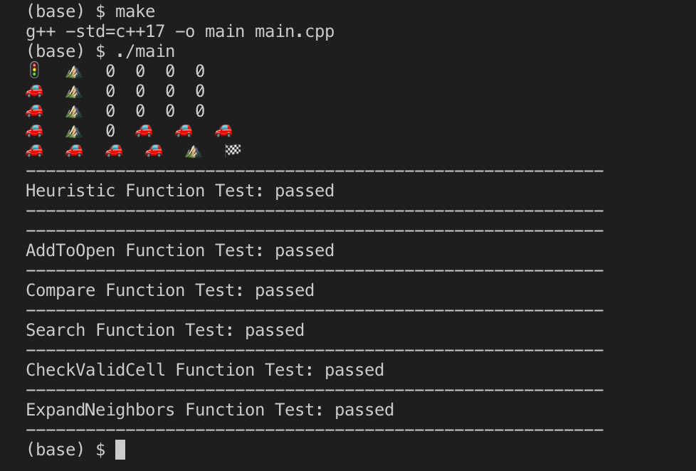

Implementation of A* Search algorithm. Code written in the context of the Udacity C++ Nanodegree (August 2019)
The heuristic used in A* Search to evaluate the distance to the goal is the Manhattan distance.

## Basic Build Instructions

1. Clone this repo.
2. Compile: `make`
3. Run it: `./main`

## Usage
1. The input is a board available in input file 1.board (0 code for a free cell ; 1 code for an obstacle cell)
2. Start cell and goal cell are hard coded in main.cpp
3. Test.cpp containds the tests of the functions.